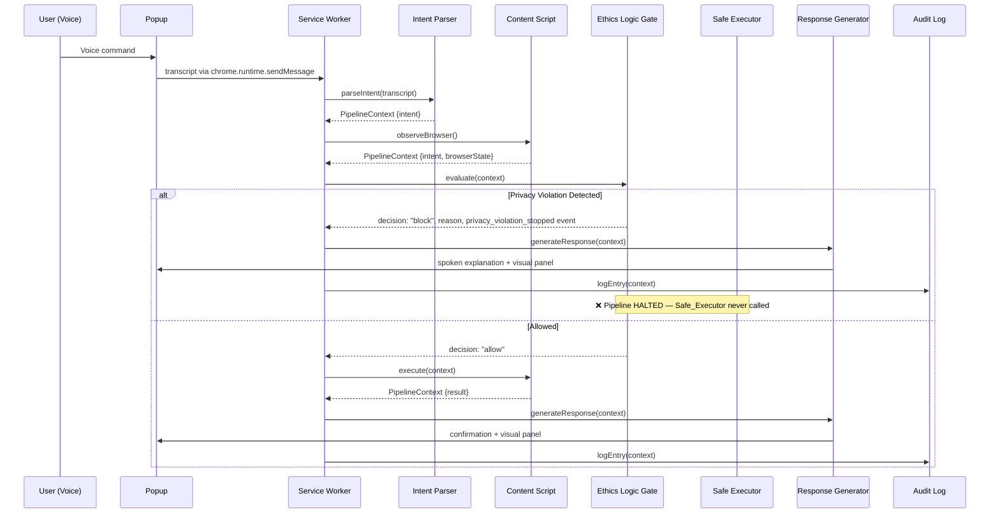

# Design Document: AllVoice Browser Copilot

## Overview

AllVoice is a Chrome Extension (Manifest V3) that serves as an inclusive browser copilot for blind and low-vision users. It processes voice commands through a six-stage pipeline — Intent_Parser → Browser_Observer → Ethics_Logic_Gate → Safe_Executor → Response_Generator → Audit_Log — to enable hands-free, ethics-guarded web interaction.

The extension is built for the Kiro Spark Challenge (Ethics frame, Inclusion Guardrail). The mandatory challenge constraint is the **Ethics Logic Gate**: a piece of code that stops the pipeline if a privacy rule is violated. This gate sits between Browser_Observer and Safe_Executor, ensuring no privacy-violating intent ever reaches execution.

### Key Design Decisions

1. **Pipeline Architecture**: A linear, synchronous pipeline where each stage transforms a shared `PipelineContext` object. This makes the flow auditable, testable, and easy to reason about.
2. **Content Script + Service Worker Split**: The Web Speech API requires a DOM context, so voice capture runs in the popup/offscreen document. DOM observation and action execution run in content scripts injected into the active tab. The service worker orchestrates pipeline flow and manages state.
3. **Ethics-First Design**: The Ethics Logic Gate is not optional middleware — it is a mandatory pipeline stage that cannot be bypassed. The pipeline function signature enforces this by requiring an ethics decision before the Safe_Executor can run.
4. **Accessibility as Default**: High-contrast mode (7:1 ratio) is the default, not an opt-in. All UI elements ship with ARIA attributes. The extension is keyboard-first.
5. **Demo-Scoped for Hackathon**: The intent parser uses keyword matching (not NLP/ML) to keep the scope achievable. Demo pages provide controlled environments for judging.

### Tech Stack

| Layer | Technology |
|---|---|
| Language | TypeScript (strict mode) |
| UI Framework | React 18 (popup, options, ethics viewer) |
| Styling | Tailwind CSS (custom high-contrast theme) |
| Build | Vite with CRXJS or vite-plugin-chrome-extension |
| Extension Runtime | Chrome Manifest V3 (service worker, content scripts) |
| Voice Input | Web Speech API (`webkitSpeechRecognition`) |
| Voice Output | Chrome TTS API (`chrome.tts.speak`) |
| Storage | `chrome.storage.local` (audit log), `chrome.storage.sync` (preferences) |

## Architecture

### System Architecture Diagram

```mermaid
graph TB
    subgraph "Chrome Extension (Manifest V3)"
        subgraph "Popup / Offscreen Document"
            MIC[🎤 Voice Capture<br/>Web Speech API]
            UI[React Popup UI<br/>High Contrast Panel]
        end

        subgraph "Service Worker (Background)"
            ORCH[Pipeline Orchestrator]
            IP[Intent Parser]
            ELG[Ethics Logic Gate]
            RG[Response Generator]
            AL[Audit Log]
            STORE[(chrome.storage)]
        end

        subgraph "Content Script (Active Tab)"
            BO[Browser Observer]
            SE[Safe Executor]
            DOM[Page DOM Access]
        end
    end

    MIC -->|transcript| ORCH
    ORCH -->|1. parse| IP
    IP -->|PipelineContext| ORCH
    ORCH -->|2. observe| BO
    BO -->|browser state| ORCH
    ORCH -->|3. evaluate| ELG
    ELG -->|ethics decision| ORCH
    ELG -.->|"❌ BLOCK (privacy stop)"| RG
    ORCH -->|4. execute (if allowed)| SE
    SE -->|result| ORCH
    ORCH -->|5. respond| RG
    RG -->|spoken + visual| UI
    ORCH -->|6. log| AL
    AL -->|persist| STORE
    SE <--> DOM
    BO <--> DOM
```

### Pipeline Flow



### Manifest V3 Architecture Constraints

- **Service Worker**: No persistent background page. The service worker can be terminated by Chrome at any time. Pipeline state is checkpointed to `chrome.storage.local` so it can be restored on restart.
- **Content Scripts**: Injected via `chrome.scripting.executeScript` with `activeTab` permission. They access the page DOM for observation and execution.
- **Popup**: React app that hosts the voice capture UI (Web Speech API needs a DOM context), the response panel, and the audit log viewer.
- **Messaging**: `chrome.runtime.sendMessage` for one-shot messages between popup ↔ service worker. `chrome.tabs.sendMessage` for service worker ↔ content script communication.


## Components and Interfaces

### 1. Pipeline Orchestrator (Service Worker)

The orchestrator is the central coordinator. It receives a transcript, drives each pipeline stage in order, and enforces the constraint that the Ethics Logic Gate must run before the Safe Executor.

```typescript
// src/pipeline/orchestrator.ts

import { PipelineContext, PipelineResult } from './types';
import { parseIntent } from './intentParser';
import { evaluateEthics } from './ethicsGate';
import { generateResponse } from './responseGenerator';
import { logEntry } from './auditLog';

/**
 * Runs the full six-stage pipeline. The Ethics Logic Gate is mandatory —
 * if it returns "block", the Safe Executor is never called.
 */
export async function runPipeline(
  transcript: string,
  observeBrowser: () => Promise<BrowserState>,
  executeAction: (intent: Intent, browserState: BrowserState) => Promise<ExecutionResult>
): Promise<PipelineResult> {
  const context: PipelineContext = {
    timestamp: Date.now(),
    rawTranscript: transcript,
    intent: null,
    browserState: null,
    ethicsDecision: null,
    executionResult: null,
    response: null,
  };

  // Stage 1: Parse intent
  context.intent = parseIntent(transcript);

  // Stage 2: Observe browser (runs in content script via messaging)
  context.browserState = await observeBrowser();

  // Stage 3: Ethics Logic Gate (MANDATORY — cannot be skipped)
  context.ethicsDecision = evaluateEthics(context.intent, context.browserState);

  // Stage 4: Safe Executor — ONLY if ethics decision is not "block"
  if (context.ethicsDecision.decision === 'block') {
    context.executionResult = { status: 'blocked', details: context.ethicsDecision.reason };
  } else {
    const intentToExecute = context.ethicsDecision.decision === 'modify'
      ? context.ethicsDecision.modifiedIntent!
      : context.intent;
    try {
      context.executionResult = await Promise.race([
        executeAction(intentToExecute, context.browserState),
        timeout(3000),
      ]);
    } catch (err) {
      context.executionResult = { status: 'error', details: String(err) };
    }
  }

  // Stage 5: Generate response
  context.response = generateResponse(context);

  // Stage 6: Audit log
  await logEntry(context);

  return context;
}
```

### 2. Intent Parser

Keyword-based parser that maps voice transcripts to structured intent objects. No ML — just pattern matching for the demo scope.

```typescript
// src/pipeline/intentParser.ts

export interface Intent {
  action: ActionType;
  target: string | null;
  parameters: Record<string, string>;
  rawTranscript: string;
}

export type ActionType =
  | 'describe_screen'
  | 'add_to_cart'
  | 'purchase'
  | 'draft_message'
  | 'send_message'
  | 'confirm_pending'
  | 'click_unlabeled'
  | 'unrecognized';

interface PatternRule {
  pattern: RegExp;
  action: ActionType;
  extractTarget?: (match: RegExpMatchArray) => string | null;
  extractParams?: (match: RegExpMatchArray) => Record<string, string>;
}

const PATTERN_RULES: PatternRule[] = [
  { pattern: /\b(describe|what'?s on|read)\b.*\b(screen|page)\b/i, action: 'describe_screen' },
  { pattern: /\badd\b.*\b(to cart|cart)\b/i, action: 'add_to_cart' },
  { pattern: /\b(buy|purchase)\b/i, action: 'purchase' },
  { pattern: /\b(draft|write|compose|type)\b.*\b(message|text|chat)\b/i, action: 'draft_message',
    extractParams: (m) => ({ messageContent: m.input?.replace(/^.*?(draft|write|compose|type)\s*(a\s*)?/i, '') || '' })
  },
  { pattern: /\bsend\b.*\b(message|text|chat)\b/i, action: 'send_message' },
  { pattern: /\b(confirm|yes|proceed)\b/i, action: 'confirm_pending' },
  { pattern: /\bclick\b.*\b(unlabeled|unknown|mystery)\b/i, action: 'click_unlabeled' },
];

export function parseIntent(transcript: string): Intent {
  for (const rule of PATTERN_RULES) {
    const match = transcript.match(rule.pattern);
    if (match) {
      return {
        action: rule.action,
        target: rule.extractTarget?.(match) ?? null,
        parameters: rule.extractParams?.(match) ?? {},
        rawTranscript: transcript,
      };
    }
  }
  return { action: 'unrecognized', target: null, parameters: {}, rawTranscript: transcript };
}
```

### 3. Browser Observer (Content Script)

Runs inside the active tab's content script context. Captures DOM state and sends it back to the service worker.

```typescript
// src/content/browserObserver.ts

export interface BrowserState {
  url: string;
  title: string;
  focusedElement: ElementSummary | null;
  interactiveElements: ElementSummary[];
  contextFlags: ('restricted-context' | 'inaccessible')[];
}

export interface ElementSummary {
  tagName: string;
  role: string | null;
  ariaLabel: string | null;
  textContent: string;
  id: string | null;
  selector: string;
  hasAccessibleName: boolean;
  type?: string;
  autocomplete?: string;
}

export function observeBrowser(): BrowserState {
  const url = window.location.href;
  const contextFlags: BrowserState['contextFlags'] = [];

  if (url.startsWith('chrome://') || url.startsWith('chrome-extension://')) {
    contextFlags.push('restricted-context');
  }

  const interactiveSelectors = 'a, button, input, select, textarea, [role="button"], [role="link"], [tabindex]';
  const elements = Array.from(document.querySelectorAll(interactiveSelectors));

  const interactiveElements: ElementSummary[] = elements.map((el) => {
    const htmlEl = el as HTMLElement;
    return {
      tagName: el.tagName.toLowerCase(),
      role: el.getAttribute('role'),
      ariaLabel: el.getAttribute('aria-label'),
      textContent: (htmlEl.textContent || '').trim().slice(0, 100),
      id: el.id || null,
      selector: buildSelector(el),
      hasAccessibleName: !!(el.getAttribute('aria-label') || el.getAttribute('aria-labelledby') || (htmlEl.textContent || '').trim()),
      type: (el as HTMLInputElement).type || undefined,
      autocomplete: el.getAttribute('autocomplete') || undefined,
    };
  });

  const focused = document.activeElement;
  const focusedSummary = focused && focused !== document.body
    ? interactiveElements.find(e => e.selector === buildSelector(focused)) || null
    : null;

  return { url, title: document.title, focusedElement: focusedSummary, interactiveElements, contextFlags };
}

function buildSelector(el: Element): string {
  if (el.id) return `#${el.id}`;
  const tag = el.tagName.toLowerCase();
  const parent = el.parentElement;
  if (!parent) return tag;
  const siblings = Array.from(parent.children).filter(c => c.tagName === el.tagName);
  if (siblings.length === 1) return `${buildSelector(parent)} > ${tag}`;
  const index = siblings.indexOf(el) + 1;
  return `${buildSelector(parent)} > ${tag}:nth-of-type(${index})`;
}
```

### 4. Ethics Logic Gate (MANDATORY — The Challenge Constraint)

This is the core ethics enforcement component. It is a **synchronous, pure function** that evaluates an intent + browser state against a set of ethics rules and returns a decision. If a privacy rule is violated, it returns `"block"` and the pipeline halts — the Safe Executor is never called.

```typescript
// src/pipeline/ethicsGate.ts

export interface EthicsDecision {
  decision: 'allow' | 'block' | 'modify';
  reason: string | null;
  ruleId: string | null;
  modifiedIntent: Intent | null;
  privacyViolation: boolean;
}

export interface EthicsRule {
  id: string;
  name: string;
  description: string;
  evaluate: (intent: Intent, browserState: BrowserState) => EthicsDecision | null;
}

// --- Default Ethics Rules ---

const SENSITIVE_AUTOCOMPLETE = ['cc-number', 'cc-csc', 'new-password'];

const sensitiveFieldRule: EthicsRule = {
  id: 'PRIVACY_SENSITIVE_FIELD',
  name: 'Sensitive Field Protection',
  description: 'Blocks actions targeting password, payment, or sensitive autocomplete fields.',
  evaluate: (intent, browserState) => {
    if (intent.action === 'describe_screen') return null; // read-only is fine
    const target = findTargetElement(intent, browserState);
    if (!target) return null;
    const isSensitive =
      target.type === 'password' ||
      SENSITIVE_AUTOCOMPLETE.includes(target.autocomplete || '');
    if (isSensitive) {
      return {
        decision: 'block',
        reason: `Action blocked: target is a sensitive field (${target.type || target.autocomplete}). AllVoice cannot interact with password or payment fields to protect your privacy.`,
        ruleId: 'PRIVACY_SENSITIVE_FIELD',
        modifiedIntent: null,
        privacyViolation: true,
      };
    }
    return null;
  },
};

const piiSubmissionRule: EthicsRule = {
  id: 'PRIVACY_PII_SUBMISSION',
  name: 'PII Submission Prevention',
  description: 'Blocks form submissions containing personally identifiable information without confirmation.',
  evaluate: (intent, browserState) => {
    if (intent.action !== 'send_message' && intent.action !== 'confirm_pending') return null;
    const messageContent = intent.parameters.messageContent || '';
    if (containsPII(messageContent)) {
      return {
        decision: 'block',
        reason: 'Action blocked: the message appears to contain personally identifiable information (email, phone, or SSN pattern). Please remove PII before sending.',
        ruleId: 'PRIVACY_PII_SUBMISSION',
        modifiedIntent: null,
        privacyViolation: true,
      };
    }
    return null;
  },
};

const unlabeledControlRule: EthicsRule = {
  id: 'SAFETY_UNLABELED_CONTROL',
  name: 'Unlabeled Control Protection',
  description: 'Blocks clicks on controls that have no accessible name.',
  evaluate: (intent, browserState) => {
    if (intent.action !== 'click_unlabeled') return null;
    return {
      decision: 'block',
      reason: 'Action blocked: this control has no accessible label. AllVoice cannot safely click an unlabeled element because its purpose is unknown.',
      ruleId: 'SAFETY_UNLABELED_CONTROL',
      modifiedIntent: null,
      privacyViolation: false,
    };
  },
};

const restrictedContextRule: EthicsRule = {
  id: 'CONTEXT_RESTRICTED',
  name: 'Restricted Context Enforcement',
  description: 'Blocks execution intents on chrome:// and extension:// pages.',
  evaluate: (intent, browserState) => {
    if (!browserState.contextFlags.includes('restricted-context')) return null;
    const readOnlyActions: ActionType[] = ['describe_screen'];
    if (readOnlyActions.includes(intent.action)) return null;
    return {
      decision: 'block',
      reason: 'Action blocked: this is a restricted browser page. Only read-type commands like "describe screen" are allowed here.',
      ruleId: 'CONTEXT_RESTRICTED',
      modifiedIntent: null,
      privacyViolation: false,
    };
  },
};

const DEFAULT_RULES: EthicsRule[] = [
  sensitiveFieldRule,
  piiSubmissionRule,
  unlabeledControlRule,
  restrictedContextRule,
];

/**
 * THE ETHICS LOGIC GATE — Mandatory pipeline stage.
 * Evaluates intent against all rules. First "block" wins.
 * This is a PURE FUNCTION: same inputs always produce the same output.
 */
export function evaluateEthics(
  intent: Intent,
  browserState: BrowserState,
  rules: EthicsRule[] = DEFAULT_RULES
): EthicsDecision {
  for (const rule of rules) {
    const result = rule.evaluate(intent, browserState);
    if (result && result.decision === 'block') {
      return result; // HALT — first blocking rule wins
    }
  }
  // Check for "modify" decisions
  for (const rule of rules) {
    const result = rule.evaluate(intent, browserState);
    if (result && result.decision === 'modify') {
      return result;
    }
  }
  return { decision: 'allow', reason: null, ruleId: null, modifiedIntent: null, privacyViolation: false };
}

// --- Helpers ---

function findTargetElement(intent: Intent, browserState: BrowserState): ElementSummary | null {
  if (intent.target) {
    return browserState.interactiveElements.find(e => e.selector === intent.target) || null;
  }
  // Heuristic: match by action type to likely element
  switch (intent.action) {
    case 'add_to_cart':
      return browserState.interactiveElements.find(e =>
        /add to cart/i.test(e.textContent) || /add.to.cart/i.test(e.ariaLabel || '')) || null;
    case 'purchase':
      return browserState.interactiveElements.find(e =>
        /buy now|purchase/i.test(e.textContent)) || null;
    case 'send_message':
      return browserState.interactiveElements.find(e =>
        /send/i.test(e.textContent) && e.tagName === 'button') || null;
    default:
      return null;
  }
}

function containsPII(text: string): boolean {
  const emailPattern = /[a-zA-Z0-9._%+-]+@[a-zA-Z0-9.-]+\.[a-zA-Z]{2,}/;
  const phonePattern = /\b\d{3}[-.]?\d{3}[-.]?\d{4}\b/;
  const ssnPattern = /\b\d{3}-\d{2}-\d{4}\b/;
  return emailPattern.test(text) || phonePattern.test(text) || ssnPattern.test(text);
}
```

### 5. Safe Executor (Content Script)

Executes approved actions on the page DOM. Only runs if the Ethics Logic Gate returned `"allow"` or `"modify"`.

```typescript
// src/content/safeExecutor.ts

export interface ExecutionResult {
  status: 'success' | 'blocked' | 'error' | 'timeout';
  details: string;
  elementsAffected?: string[];
}

export async function executeAction(
  intent: Intent,
  browserState: BrowserState
): Promise<ExecutionResult> {
  switch (intent.action) {
    case 'describe_screen':
      return describeScreen(browserState);
    case 'add_to_cart':
    case 'purchase':
    case 'send_message':
      return clickButton(intent, browserState);
    case 'draft_message':
      return draftMessage(intent, browserState);
    case 'confirm_pending':
      return confirmPending(intent, browserState);
    default:
      return { status: 'error', details: `No executor for action: ${intent.action}` };
  }
}

function describeScreen(browserState: BrowserState): ExecutionResult {
  const labeled = browserState.interactiveElements.filter(e => e.hasAccessibleName);
  const unlabeled = browserState.interactiveElements.filter(e => !e.hasAccessibleName);
  const summary = [
    `Page: ${browserState.title}`,
    `${labeled.length} labeled controls found.`,
    unlabeled.length > 0
      ? `${unlabeled.length} unlabeled controls detected: ${unlabeled.map(e => `${e.tagName} at ${e.selector}`).join(', ')}`
      : 'All controls have accessible names.',
  ].join(' ');
  return { status: 'success', details: summary };
}

function clickButton(intent: Intent, browserState: BrowserState): ExecutionResult {
  const target = findTargetElement(intent, browserState);
  if (!target) return { status: 'error', details: `Could not find target element for ${intent.action}` };
  const el = document.querySelector(target.selector) as HTMLElement | null;
  if (!el) return { status: 'error', details: `Element not found in DOM: ${target.selector}` };
  el.click();
  return { status: 'success', details: `Clicked: ${target.textContent || target.tagName}`, elementsAffected: [target.selector] };
}

function draftMessage(intent: Intent, browserState: BrowserState): ExecutionResult {
  const composer = browserState.interactiveElements.find(
    e => e.tagName === 'input' || e.tagName === 'textarea'
  );
  if (!composer) return { status: 'error', details: 'No text input found on page' };
  const el = document.querySelector(composer.selector) as HTMLInputElement | HTMLTextAreaElement | null;
  if (!el) return { status: 'error', details: `Composer not found: ${composer.selector}` };
  el.value = intent.parameters.messageContent || '';
  el.dispatchEvent(new Event('input', { bubbles: true }));
  el.focus();
  return { status: 'success', details: `Drafted message in ${composer.tagName}`, elementsAffected: [composer.selector] };
}

function confirmPending(_intent: Intent, _browserState: BrowserState): ExecutionResult {
  // Placeholder for confirming a pending action (e.g., a modal dialog)
  return { status: 'success', details: 'Pending action confirmed.' };
}
```

### 6. Response Generator

Produces accessible spoken and visual feedback. Every response is delivered via Chrome TTS and displayed in the popup panel.

```typescript
// src/pipeline/responseGenerator.ts

export interface ResponseMessage {
  text: string;
  type: 'success' | 'blocked' | 'error' | 'info';
}

export function generateResponse(context: PipelineContext): ResponseMessage {
  const { ethicsDecision, executionResult } = context;

  if (ethicsDecision?.decision === 'block') {
    return {
      text: ethicsDecision.reason || 'This action was blocked by the ethics gate.',
      type: 'blocked',
    };
  }

  if (executionResult?.status === 'error') {
    return {
      text: `Something went wrong: ${executionResult.details}. Try again or use a different command.`,
      type: 'error',
    };
  }

  if (executionResult?.status === 'timeout') {
    return {
      text: 'The action took too long and was stopped. Please try again.',
      type: 'error',
    };
  }

  return {
    text: executionResult?.details || 'Action completed.',
    type: 'success',
  };
}

/** Speaks the response via Chrome TTS and updates the popup UI */
export function deliverResponse(response: ResponseMessage): void {
  // Speak via Chrome TTS API
  chrome.tts.speak(response.text, {
    rate: 1.0,
    enqueue: false,
  });

  // Send to popup for visual display
  chrome.runtime.sendMessage({
    type: 'RESPONSE_UPDATE',
    payload: response,
  });
}
```

### 7. Audit Log

Persists every pipeline invocation to Chrome local storage in structured JSON.

```typescript
// src/pipeline/auditLog.ts

export interface AuditLogEntry {
  id: string;
  timestamp: number;
  rawTranscript: string;
  intent: Intent | null;
  browserStateSummary: { url: string; title: string; contextFlags: string[] } | null;
  ethicsDecision: { decision: string; reason: string | null; ruleId: string | null; privacyViolation: boolean } | null;
  executionResult: { status: string; details: string } | null;
  response: { text: string; type: string } | null;
}

const STORAGE_KEY = 'allvoice_audit_log';
const RETENTION_DAYS = 30;

export async function logEntry(context: PipelineContext): Promise<void> {
  const entry: AuditLogEntry = {
    id: crypto.randomUUID(),
    timestamp: context.timestamp,
    rawTranscript: context.rawTranscript,
    intent: context.intent,
    browserStateSummary: context.browserState
      ? { url: context.browserState.url, title: context.browserState.title, contextFlags: context.browserState.contextFlags }
      : null,
    ethicsDecision: context.ethicsDecision
      ? { decision: context.ethicsDecision.decision, reason: context.ethicsDecision.reason, ruleId: context.ethicsDecision.ruleId, privacyViolation: context.ethicsDecision.privacyViolation }
      : null,
    executionResult: context.executionResult
      ? { status: context.executionResult.status, details: context.executionResult.details }
      : null,
    response: context.response
      ? { text: context.response.text, type: context.response.type }
      : null,
  };

  const { [STORAGE_KEY]: existing = [] } = await chrome.storage.local.get(STORAGE_KEY);
  const log: AuditLogEntry[] = existing;
  log.unshift(entry); // newest first

  // Prune entries older than retention period
  const cutoff = Date.now() - RETENTION_DAYS * 24 * 60 * 60 * 1000;
  const pruned = log.filter(e => e.timestamp >= cutoff);

  await chrome.storage.local.set({ [STORAGE_KEY]: pruned });
}

export async function getAuditLog(): Promise<AuditLogEntry[]> {
  const { [STORAGE_KEY]: log = [] } = await chrome.storage.local.get(STORAGE_KEY);
  return log;
}
```

### 8. Voice Capture (Popup)

Manages the Web Speech API lifecycle in the popup context.

```typescript
// src/popup/voiceCapture.ts

export interface VoiceCaptureCallbacks {
  onTranscript: (transcript: string) => void;
  onError: (error: string) => void;
  onStateChange: (listening: boolean) => void;
}

export function createVoiceCapture(callbacks: VoiceCaptureCallbacks) {
  const SpeechRecognition = window.webkitSpeechRecognition || window.SpeechRecognition;
  if (!SpeechRecognition) {
    callbacks.onError('Web Speech API is not available in this browser.');
    return null;
  }

  const recognition = new SpeechRecognition();
  recognition.continuous = false;
  recognition.interimResults = false;
  recognition.lang = 'en-US';

  recognition.onresult = (event: SpeechRecognitionEvent) => {
    const transcript = event.results[0][0].transcript;
    callbacks.onTranscript(transcript);
  };

  recognition.onerror = (event: SpeechRecognitionErrorEvent) => {
    callbacks.onError(`Speech recognition error: ${event.error}`);
  };

  recognition.onstart = () => callbacks.onStateChange(true);
  recognition.onend = () => callbacks.onStateChange(false);

  return {
    start: () => recognition.start(),
    stop: () => recognition.stop(),
  };
}
```

### Component Communication Map

| From | To | Mechanism | Data |
|---|---|---|---|
| Popup | Service Worker | `chrome.runtime.sendMessage` | `{ type: 'VOICE_TRANSCRIPT', transcript }` |
| Service Worker | Content Script | `chrome.tabs.sendMessage` | `{ type: 'OBSERVE_BROWSER' }` or `{ type: 'EXECUTE_ACTION', intent, browserState }` |
| Content Script | Service Worker | `sendResponse` callback | `BrowserState` or `ExecutionResult` |
| Service Worker | Popup | `chrome.runtime.sendMessage` | `{ type: 'RESPONSE_UPDATE', payload: ResponseMessage }` |
| Service Worker | Storage | `chrome.storage.local.set` | `AuditLogEntry[]` |
| Service Worker | Storage | `chrome.storage.sync.set` | User preferences |

## Data Models

### Core TypeScript Interfaces

```typescript
// src/pipeline/types.ts

/** The shared context object passed through all six pipeline stages */
export interface PipelineContext {
  timestamp: number;
  rawTranscript: string;
  intent: Intent | null;
  browserState: BrowserState | null;
  ethicsDecision: EthicsDecision | null;
  executionResult: ExecutionResult | null;
  response: ResponseMessage | null;
}

export interface Intent {
  action: ActionType;
  target: string | null;
  parameters: Record<string, string>;
  rawTranscript: string;
}

export type ActionType =
  | 'describe_screen'
  | 'add_to_cart'
  | 'purchase'
  | 'draft_message'
  | 'send_message'
  | 'confirm_pending'
  | 'click_unlabeled'
  | 'unrecognized';

export interface BrowserState {
  url: string;
  title: string;
  focusedElement: ElementSummary | null;
  interactiveElements: ElementSummary[];
  contextFlags: ('restricted-context' | 'inaccessible')[];
}

export interface ElementSummary {
  tagName: string;
  role: string | null;
  ariaLabel: string | null;
  textContent: string;
  id: string | null;
  selector: string;
  hasAccessibleName: boolean;
  type?: string;
  autocomplete?: string;
}

export interface EthicsDecision {
  decision: 'allow' | 'block' | 'modify';
  reason: string | null;
  ruleId: string | null;
  modifiedIntent: Intent | null;
  privacyViolation: boolean;
}

export interface EthicsRule {
  id: string;
  name: string;
  description: string;
  evaluate: (intent: Intent, browserState: BrowserState) => EthicsDecision | null;
}

export interface ExecutionResult {
  status: 'success' | 'blocked' | 'error' | 'timeout';
  details: string;
  elementsAffected?: string[];
}

export interface ResponseMessage {
  text: string;
  type: 'success' | 'blocked' | 'error' | 'info';
}

export interface AuditLogEntry {
  id: string;
  timestamp: number;
  rawTranscript: string;
  intent: Intent | null;
  browserStateSummary: {
    url: string;
    title: string;
    contextFlags: string[];
  } | null;
  ethicsDecision: {
    decision: string;
    reason: string | null;
    ruleId: string | null;
    privacyViolation: boolean;
  } | null;
  executionResult: {
    status: string;
    details: string;
  } | null;
  response: {
    text: string;
    type: string;
  } | null;
}

export interface UserPreferences {
  highContrastMode: boolean;
  microphoneShortcut: string;
  auditLogRetentionDays: number;
}
```

### Chrome Storage Schema

```
chrome.storage.local:
  allvoice_audit_log: AuditLogEntry[]     // Audit log entries, newest first
  allvoice_pipeline_state: PipelineContext | null  // Checkpoint for service worker restart

chrome.storage.sync:
  allvoice_preferences: UserPreferences   // Synced across devices
```

### Manifest V3 Configuration

```json
{
  "manifest_version": 3,
  "name": "AllVoice Browser Copilot",
  "version": "1.0.0",
  "description": "Inclusive browser copilot for blind and low-vision users",
  "permissions": ["activeTab", "tts", "storage", "scripting"],
  "background": {
    "service_worker": "src/background/serviceWorker.ts"
  },
  "action": {
    "default_popup": "popup.html",
    "default_icon": "icons/allvoice-128.png"
  },
  "content_scripts": [
    {
      "matches": ["<all_urls>"],
      "js": ["src/content/contentScript.ts"],
      "run_at": "document_idle"
    }
  ],
  "commands": {
    "toggle-microphone": {
      "suggested_key": { "default": "Alt+Shift+V" },
      "description": "Toggle voice input"
    },
    "open-audit-log": {
      "suggested_key": { "default": "Alt+Shift+L" },
      "description": "Open audit log"
    },
    "toggle-contrast": {
      "suggested_key": { "default": "Alt+Shift+C" },
      "description": "Toggle high contrast mode"
    }
  },
  "icons": {
    "16": "icons/allvoice-16.png",
    "48": "icons/allvoice-48.png",
    "128": "icons/allvoice-128.png"
  }
}
```

### Demo Page Structure

```
demo/
├── product.html    # "Add to Cart", "Buy Now", mystery button (no label)
└── chat.html       # Chat composer <input>, "Send" button
```

**demo/product.html** key elements:
- `<button id="add-to-cart">Add to Cart</button>`
- `<button id="buy-now">Buy Now</button>`
- `<button id="mystery-btn"></button>` — no text, no aria-label, no title

**demo/chat.html** key elements:
- `<input id="chat-composer" type="text" placeholder="Type a message..." />`
- `<button id="send-btn">Send</button>`

### Project File Structure

```
allvoice-browser-copilot/
├── manifest.json
├── package.json
├── tsconfig.json
├── vite.config.ts
├── tailwind.config.ts
├── src/
│   ├── pipeline/
│   │   ├── types.ts              # All shared interfaces
│   │   ├── orchestrator.ts       # Pipeline coordinator
│   │   ├── intentParser.ts       # Stage 1: Voice → Intent
│   │   ├── ethicsGate.ts         # Stage 3: Ethics Logic Gate
│   │   ├── ethicsRules.ts        # Default ethics rules
│   │   ├── responseGenerator.ts  # Stage 5: Response creation
│   │   └── auditLog.ts           # Stage 6: Audit persistence
│   ├── content/
│   │   ├── contentScript.ts      # Content script entry point
│   │   ├── browserObserver.ts    # Stage 2: DOM observation
│   │   └── safeExecutor.ts       # Stage 4: DOM action execution
│   ├── background/
│   │   └── serviceWorker.ts      # MV3 service worker
│   ├── popup/
│   │   ├── Popup.tsx             # Main popup React component
│   │   ├── VoiceButton.tsx       # Mic toggle with a11y
│   │   ├── ResponsePanel.tsx     # High-contrast response display
│   │   ├── AuditLogViewer.tsx    # Accessible log list
│   │   ├── EthicsRulesViewer.tsx # Ethics rules display
│   │   └── voiceCapture.ts       # Web Speech API wrapper
│   ├── styles/
│   │   └── globals.css           # Tailwind + high-contrast theme
│   └── utils/
│       ├── piiDetector.ts        # PII pattern matching
│       └── accessibility.ts      # ARIA helpers, focus management
├── demo/
│   ├── product.html
│   └── chat.html
├── tests/
│   ├── unit/
│   │   ├── intentParser.test.ts
│   │   ├── ethicsGate.test.ts
│   │   ├── responseGenerator.test.ts
│   │   └── auditLog.test.ts
│   └── property/
│       ├── intentParser.property.test.ts
│       ├── ethicsGate.property.test.ts
│       ├── pipelineContext.property.test.ts
│       └── auditLog.property.test.ts
└── icons/
    ├── allvoice-16.png
    ├── allvoice-48.png
    └── allvoice-128.png
```
